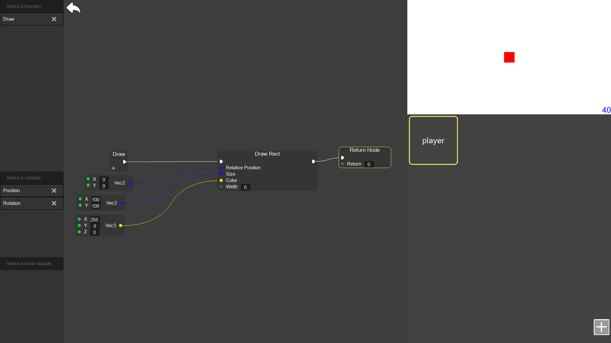
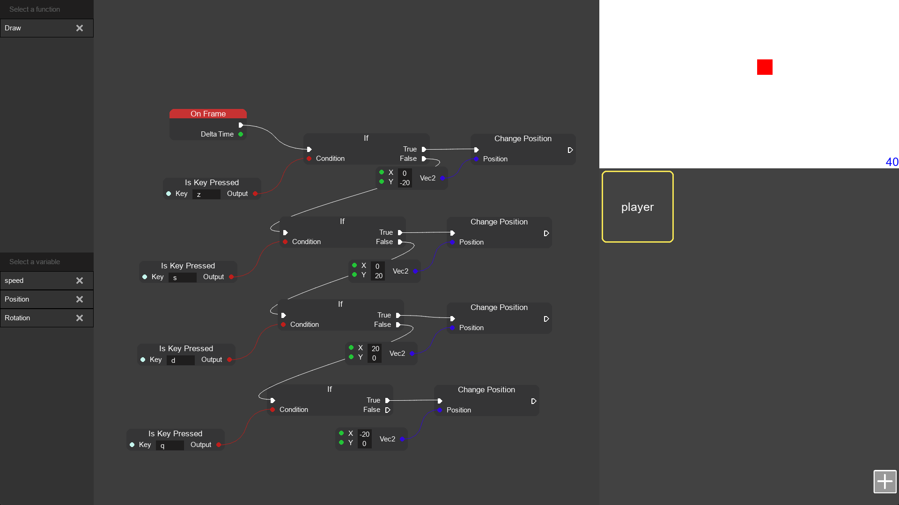
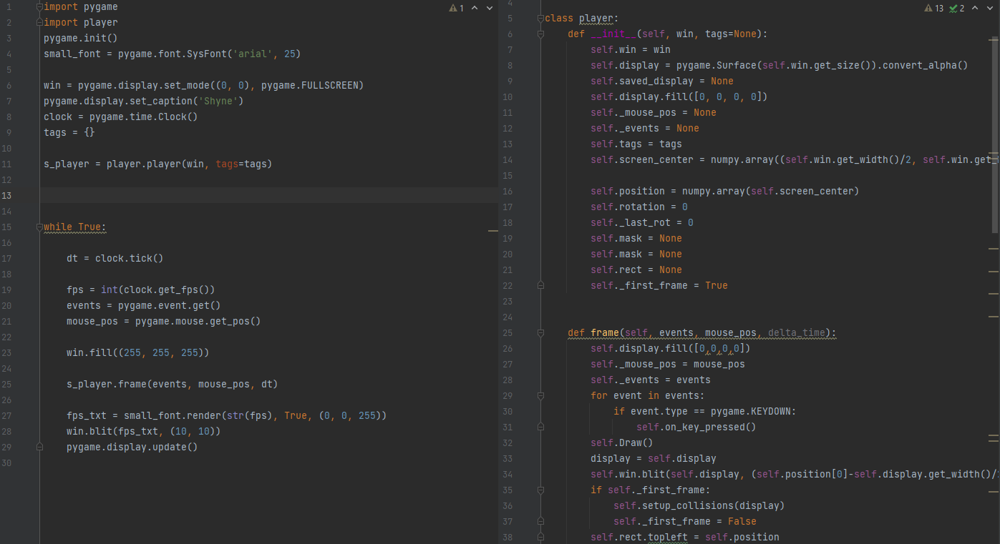

# Shyne: A lightweight game engine developed in Python, designed for rapid prototyping of pygame applications.

Powered by pyNDL, a node-based programming language, Shyne enables you to translate your nodal structure into a fully functional Python-based structure with one click.


## Screenshots






## Installation

Install Shyne using pip

```python
  pip install shyne
```
    
## Usage/Examples

```python
from Shyne import Shyne

shyne = Shyne("Name")
```

